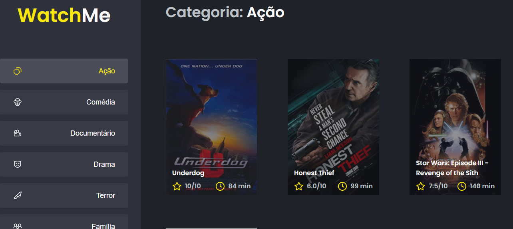

# Desafio 2 - Ignite Trilha ReactJS

_pt-br_(<-- two spaces)

Desafio: _Essa será uma aplicação onde o seu principal objetivo é refatorar uma página para listagem de filmes de acordo com gênero._

**Install**

### `yarn install`

Instalar as dependencias do projeto.

### `yarn server`

Rodar a fakeApi.

### `yarn dev`

rodar a App em [localhost](http://localhost:8080)

_en-us_(<-- two spaces)

Challenge: _This will be an application where its main objective is to refactor a page for listing films according to genre._

**Install**

### `yarn install`

Install as project dependencies.

### `yarn server`

Run a fakeApi.

### `yarn dev`

run the App on [localhost] (http: // localhost: 8080)

## Media

## Node version

v14.15.4
